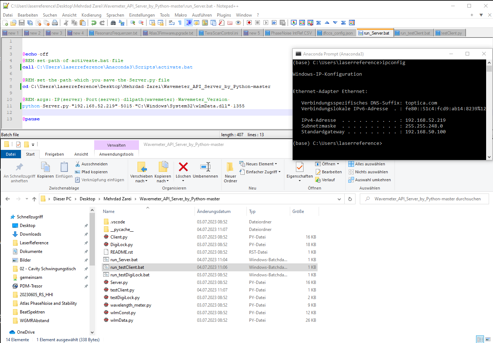
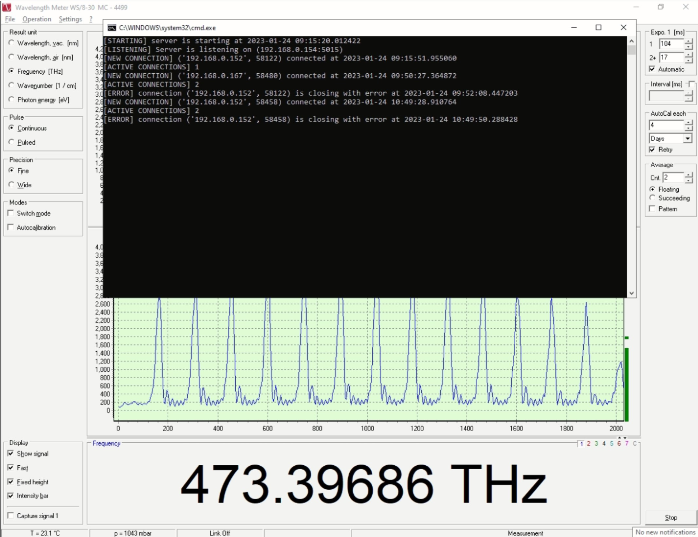
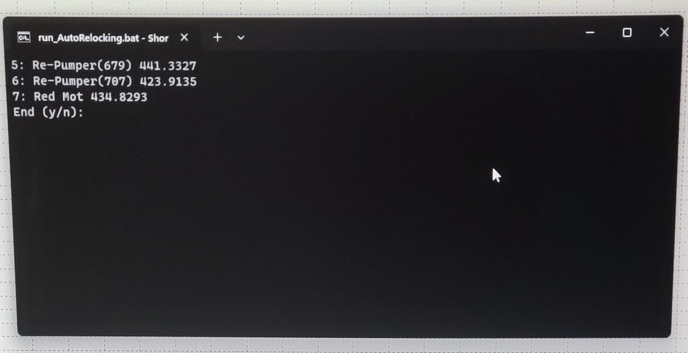
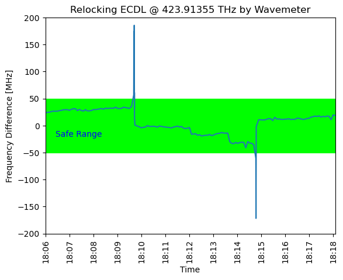
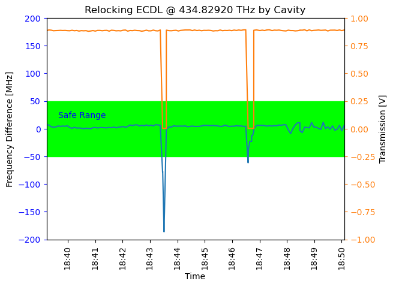

Auto Relocking ECDL using Python
========================================

This project is for automatically relocking the External Cavity Diode Lasers (ECDLs) by 
wavemeter and/or cavity transmission using Python.

|

.. contents:: Table of Contents
    :depth: 2


Overview
****************************************

In this project, I will present a simple, cheap, and quite universal locking and relocking system used for many types of lasers like external-cavity diode lasers (ECDLs), TiSa, etc. 
This developed procedure and software could improve the uptime of cold-atom experiments. 
It is mainly achieved by autonomous systems keeping the lasers in optimal condition. 
The system is based on Python software that runs on the PC. 
I have integrated the Python software with the High-Finesse wavelength meter so that the software can detect deviations from the target frequency, in other words, creating an error signal and multimode operation of the ECDL laser. 
I have used National Instruments cards to control the laser systems by applying feedback and monitoring the state of the laser to the optical cavity lock. 
I have developed an algorithm for locking and relocking lasers, which need moderate precision and relocking lasers locked by a fast locking technique like cavity to target frequency and for ECDL single-mode operation recovering.

|

We have tested this system with many different lasers at KLFAMO with an optical atomic clock experiment, at the UvA with the Rydberg laser in an optical tweezers experiment `click here for this project`_, and also at Toptica company. 
TiSa and ECDL lasers' stabilization and relocking work as intended in the long term. 
.. _click here for this project: https://github.com/mehrdadzarei/AutoRelocking_ECDL_Laser_by_Redpitaya


Introduction
****************************************

Fig. 1 presents a schematic diagram illustrating the process of the automatic relocking system employed in our experiments. 
The laser light originates from an ECDL, whose frequency can be modulated via a piezo and current controller with voltage inputs inside the laser driver. 
Alternatively, we use a Titanium-Sapphire (TiSa) laser with frequency control voltage input as a light source. 
Initial frequency stabilization is achieved with a wavelength meter, and a subsequent, more precise stabilization is obtained with a high-finesse optical cavity. 
Therefore, part of the laser beam is directed to the wavelength meter while another portion is routed to the ultra-stable high-finesse cavity. 
Locking to the optical cavity is crucial in subsystems requiring a narrow spectrum of laser, such as using a red laser for cooling atoms at intercombination (689 nm) transition of 7 kHz linewidth, using a clock laser to interrogate atoms at sub-Hz linewidth 698 nm transition. 
The wavelength meter is pivotal in initial frequency tuning to ensure tuning with the correct cavity mode and absolute target frequency. 
For some lasers, like repumper lasers, stabilization to within tens of MHz suffices. 
In these scenarios, relocking is performed using only a wavelength meter.

.. 
  comments
  for new line write |
  for images with caption write figure
  without caption use image

.. figure:: doc/img/3.3 schematic Auto Relocking ECDL.png
  :width: 1000
  :align: center
  :alt: Schematic diagram of the auto relocking system in the experiment.
  
  Fig. 1: Schematic diagram of the auto relocking system in the experiment.

Part of the laser beam goes to the mechanical switcher of the wavemeter through an optical fiber. 
The mechanical switcher enables access to eight optical fibers, which can be measured by just one wavelength meter. 
This is a commercial wavelength meter from High-Finesse. 
The wavemeter software is based on the dynamic-link library (DLL) C/C++ module and is easily integrated into the Ctype Python package. 
Therefore, I developed a Python package to fully access the wavemeter, including running the software, starting measurement, controlling exposure time, swapping between different channels, and stopping the software. 
The Python package for the wavelength meter has been tested with three different models of High-Finesse wavelength meters, WS6, WS7, and WS7-UV, available in the FAMO laboratory. 
This package can be run on any operating system that supports wavemeter software and also has Python installed with all the libraries needed for this package.

|

A National Instruments (NI) card USB-6229 is used in this experiment to collect the signal (ADC) from the PhotoDiode (PD), which detects the transmission signal out of the cavity and also sends the feedback (DAC) to the laser driver for piezo and current controllers. 


Experimental Setup
****************************************

We need to connect the laser beam to the wavemeter to run the auto relocking program. 
If the laser is locked by a cavity, transmission of the laser beam would be detected by a photodiode, and the output of that needs to be connected to an input of the DAQ card. 
The DAQ card should be connected to the computer on which the auto relocking program will be run. 
One of the output signals from DAQ should be connected to the laser driver to apply voltage to the piezo. 
The way to do that is to use an analog interface module from the Toptica laser driver, but before applying any voltage on it, be sure that its internal jumper is set on 'DA#2'. 
Otherwise, voltage is not applied to the piezo. 
Another output can be connected to the modulation input port of the current controller module to apply voltage to the current.

|

Three lasers are involved in testing the software. 
Two of them are repumpers, including 707 nm and 679 nm. 
These two need to be relocked only by the wavemeter. 
The other laser is 689 nm; this laser needs to be locked first by an ultra-stable cavity; therefore, this laser is relocked by wavemeter and cavity transmission.

.. note::

    I would not recommend turning on the unlimited integrator for the 689 nm laser, which will be locked first by an ultra-stable cavity with the PDH method and FALC 110 module from Toptica. 
    This option applies extra feedback to keep the laser locked. 
    But when the laser is unlocked, based on the scan range of this integrator, it will push the frequency much farther than when this option is off. 
    So it would be much faster to relock by this developed program when this integrator is not on.

The experimental setup is shown in Fig. 2. The NI DAQ output in part a is connected to the laser driver in part b from the analog interface module. The laser beam from the laser diode in part c is coupled to an optical fiber and sent to the wavemeter in part d of the figure.

.. figure:: doc/img/3.3 auto setup.png
  :width: 1000
  :align: center
  :alt: Schematic diagram of the auto relocking system in the experiment.
  
  Fig. 2: Experimental setup for the auto relocking system.


Relocking Software
****************************************

Run the Server on the Wavemeter’s PC
########################################

Before running the main auto relocking program, the server should be run on the system with wavemeter software. 
In the source code folder there is a batch file named 'run_Server.bat'. 
By running this batch file, the server starts running, but before running it, it needs to be modified based on the computer that is going to be run as shown in Fig. 3. 
First, the path of the activate file needs to be set. 
To find this path, go to the directory in which Python is installed. 
Second is the path of this program. 
At the end, a command to run the server with defining IP address, port number, dll path of wavemeter, and version number of wavemeter. 
IP address must be the private IP address of the system, which is accessible by the internal network, and to find it, the operator can run 'ipconfig' in cmd. 
The port number can be any number, the operator can leave as a default, but if any other device uses this port, the operator needs to change it to another number. 
The dll path of the wavemeter is usually the same, but if it is different on the system, find that path and paste it here. 
The last one is the wavemeter version, which depends on the model of the wavemeter the operator is using. 


  
  Fig. 3: Finding the IP address for the server and modifying the batch file.

After running the server, if the server starts listening, a message will be printed that the server is listening on this IP address and port number, as shown in Fig. 4. 
This IP address and port number should be set in the JSON file to let the auto relocking program as a client connect to the server and get information from the wavemeter. 


  
  Fig. 4: Running server on the wavemeter's PC.

.. note::

    For downloading the server application click on `Wavemeter API Server`_.
.. _Wavemeter API Server: https://github.com/mehrdadzarei/Wavemeter_API_Server_by_Python


Modify JSON file and run the auto relocking program
########################################

To interact with the program and apply new changes, I prepared a JSON file with all the parameters that need to be modified by the operator. This file is in the main directory of the source code as 'setting.json'.

|

This file has five primary keys, including "general"; the operator should define the path that the main auto relocking program is inside, the IP address, and the server port on which the wavemeter program is running. 
Moreover, WLMPrec is dependent on the precision of the wavemeter. 
The one I am testing has five digits precision. 
The following key is "chName"; you can set all the parameters for each channel. 
The next one is "IParam" which defines the parameters of current relocking. 
The parameters with the comment "don't change" should not be changed. 
The program saves these parameters, and when the program stops after a while, the operator should rerun it. 
The program will read these parameters for extra information and improve the relock. 
The following key, "PztParam" is used for piezo relocking. 
The last one is "refDataInfo"; here, you can define the safe range of relocking and an extra parameter to reduce the safe range. 
This is used when the program is in the relocking mode. 
At this time, the safe range would be reduced by this parameter to let the auto relocking program set the frequency close to the target.

Part of the JSON file is written below:

```json
{
    "general": [
        {
            "path": "C:\\Users\\stront\\Mehrdad\\
                AutoRelocking_ECDL_Python",
            "IP": "192.168.3.212",
            "PORT": 5015,
            "WLMPrec": 4
        }
    ],
    "chName": [
        {
            "description": "[name, target frequency, 
                PiezoRelockMode (0 or 1), 
                CurrentRelockMode (0 or 1), 
                update (0 or 1), portNamePiezo, 
                portNameCurrent, portNameInput, 
                cavityLock, wavemeterLock, laserDrift]"
        },
        {
            "5": [
                "5: Re-Pumper(679)", # optional name
                "441.3327",          # target frequency
                1,         # send feedback to piezo set on 1
                0,         # send feedback to current set on 1
                0,         # update in each cycle set on 1
                "Dev2/ao2",   # port name for piezo
                "Dev2/ao3",   # port name for current
                "",           # port name for input
                0,            # for cavity lock set on 1
                1,            # for wavemeter lock set on 1
                1             # to apply laser drift set on 1
            ],
        }
    ],
    "IParam": [
        {
            "description": "[min, max, last_value, 
                cur_drift0, cur_drift1, drift_no]"
        },
        {
            "5": [
                -1.0,       # minimum scan range value
                1.0,        # maximum scan range value
                0,          # don't change
                0.0,        # don't change
                1.0,        # don't change
                0.0         # don't change
            ],
        }
    ],
    "PztParam": [
        {
            "description": "[min, max, last_value, 
                piezo_drift0, piezo_drift1, t_drift0, 
                t_drift1, drift_no, t1Drift, firstDrift_t]"
        },
        {
            "5": [
                -3.0,       # minimum scan range value
                3.0,        # maximum scan range value
                0,          # don't change
                0.0,        # don't change
                1.0,        # don't change
                0.0,        # don't change
                0.0,        # don't change
                0,          # don't change
                0.0,        # don't change
                60          # don't change
            ],
        }
    ],
    "refDataInfo": [
        {
            "description": "[no peaks diff, freq_diff_thr, 
                freq_diff_std, transmission level]"
        },
        {
            "5": [
                0,          # don't change
                5e-05,      # safe range
                4e-05,      # reduce safe range
                0           # cavity transmission level
            ],
        }
    ]
}
```

In the auto relocking source code folder, there is a batch file to run the program with the name 'run_AutoRelocking.bat'. 
Here, similar to the server program, the operator needs to modify this batch file, but only the activated path and path of the program. 
After running this batch file, the auto relocking program will start working by checking all the laser frequencies, as shown in Fig. 5. 
As seen in this figure, to stop the program, the operator needs to write y and enter the program will stop working. 
Also, a status would be printed to let the operators know. 
For example, if one of the lasers is in the mode of relocking, a message shows that this laser is relocking; therefore, the wavemeter is locked on that channel. 
Alternatively, if relocking is not successful, it will written, and that laser will not be checked for relocking after that.


  
  Fig. 5: Auto relocking program when it is running.

Results
****************************************

Fig. 6 presented how the procedure algorithm works for the 707 nm ECDL laser. 
Relocking is done only by the wavemeter with a target frequency set on 423.91355 THz and +/- 50 MHz of the safe range. 
In this 12 minutes test, as it is shown two times laser got unlocked intentionally by changing the piezo voltage knob on the laser driver and quickly relocked by the program. 
Relocking is started when the frequency is farther than 50 MHz or going outside of the green range. 


  
  Fig. 6: Relocking procedure by wavemeter for 707 nm ECDL.

Fig. 7 presented how the procedure algorithm works for the 689 nm ECDL laser. 
In this case, relocking is done by wavemeter and cavity transmission together with a target frequency set on 434.82920 THz and +/- 50 MHz of the safe range. 
Here, as seen, two pieces of information are to be processed: frequency, similar to the previous result, and cavity transmission. 
In this 12 minutes test, as it is shown two times laser got unlocked intentionally by changing the piezo voltage knob on the laser driver and quickly relocked by the program. 
As I explained before, the priority is cavity transmission in this relocking method. 
As transmission is dropped, relocking is started. 
As it is evident in this laser, which is locked first by an ultra-stable cavity, the frequency of the laser beam is stable, and there is not that much drift in the frequency.
However, in the previous result, in which the 707 nm laser is locked only by the wavemeter, the drift is seen.


  
  Fig. 7: Relocking procedure by wavemeter and cavity for 689 nm ECDL.

Where is used this Software
****************************************

This software is used wherever you want to fully control the ECDLs. This program works in two mode, 
manual and automatic mode. In each mode it is usable for:

#. Manual Mode

  * Controlling Piezo Voltage of the Laser Driver
  * Controlling Current Voltage of the Laser Driver

#. Automatic Mode

  * Relocking ECDLs only by Cavity Transmission
  * Relocking ECDLs only by Wavemeter
  * Relocking ECDLs by Cavity Transmission and Wavemeter

.. note::

    If you want to use Wavemeter, Server should be running on the Wavemeter's PC


Caution
****************************************

Please before applying any voltage on your laser driver, first monitor them on the oscilloscope and limit 
the range based on the feature of your laser driver. **The author will not take any responsibility for damaged lasers**.


Acknowledgment
****************************************

This project 18SIB05 ROCIT has received funding from the EMPIR program co-financed by the Participating States 
and from the European Union’s Horizon 2020 research and innovation program. This project has received funding 
from the European Union’s Horizon 2020 Research and Innovation Program No 820404, (iqClock project). 
This project has received funding from the European Union’s Horizon 2020 research and innovation program under 
grant agreement No 860579 (MoSaiQC project). The project is partially performed at the National Laboratory 
FAMO (KL FAMO) in Toruń, Poland and were supported by a subsidy from the Polish Ministry of Science and Higher Education.

|
I am a Ph.D. student at Nicolaus Copernicus University under the supervision of Michal Zawada. This project was done at the KLFAMO group. This project has been tested at the University of Amsterdam in the Strontium quantum gas group under the supervision of Florian Schreck during my secondment and also at Toptica company. 

